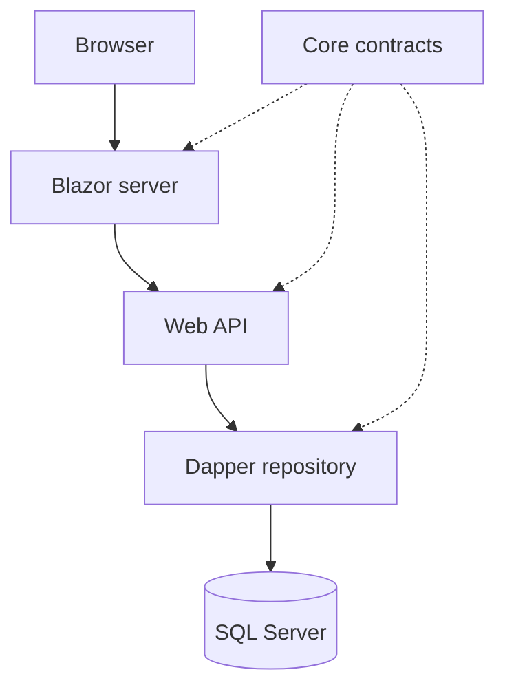

# Viwe.Portfolio

A .NET 10 portfolio with Home, About, Skills, Projects and Services, plus a protected admin area. Public content comes from SQL Server through Dapper and the API. Admins create drafts, edit entries, publish/unpublish and archive entries without hard deletion.

## Exactly five projects

| Existing project | Type | Folders and responsibility |
|---|---|---|
| `MyPortfolio/MyPortfolio.web.csproj` | Blazor Web App, Interactive Server | `Components/Pages` public routes, `Components/Pages/Admin` editors, `Components/Pages/Account` sign-in, `Components/Layout`, `Services` API client, `wwwroot` styling |
| `Api/MyPortfolio.Api.csproj` | ASP.NET Core Web API | `Controllers` public content, admin CRUD and authentication; `Program.cs` dependency injection and authorization |
| `MyPortfolio.Core` | Class Library | `Models` content model and section enum, `DTOs` login/session contracts, `Interfaces` repository contract |
| `DataAcccess` | Class Library | `Connections` SQL connection factory, `Repositories` Dapper stored-procedure implementation |
| `Database` | SQL database project | `Tables`, `StoredProcedures`, `Scripts` initial content and post-deployment seed |

The original `DataAcccess` directory spelling is preserved. The stale solution reference to `ClassLibrary` was corrected. No extra class library is required.



The database project publishes schema; it is not a runtime reference. `PortfolioEntry` is a shared content model for four sections so a first portfolio needs only one tested editing workflow. `Category` can hold a skill group or a project status such as Planned. About supports multiple biography/education/experience entries.

## First run in Visual Studio

1. Install Visual Studio with the .NET 10 SDK, ASP.NET/web development workload and the standard **SQL Server Data Tools** individual component (Visual Studio Installer → Modify → Individual components). Install SQL Server Express LocalDB (Windows) or use SQL Server 2022+. Open `MyPortfolioApp.slnx`.
2. Build the solution. Right-click `Database` → Publish. Target `(localdb)\MSSQLLocalDB`, database name `ViwePortfolio`. Inspect the generated script, then publish. Alternatively, use `SqlPackage` or open `Database/Scripts/CreateDevelopmentDatabase.sql` in SSMS, enable **Query → SQLCMD Mode**, and run it against LocalDB to create a new database. The script deliberately refuses an existing database; use publishing for later changes. Post-deployment seeds starter content only when the content table is empty. It never replaces edits on republish. CLI alternative: build the DACPAC and deploy it using `SqlPackage /Action:Publish` with your target connection string.
3. If using another SQL instance, set the API connection string through **API → Manage User Secrets**:

```json
{
  "ConnectionStrings": {
    "Portfolio": "Server=YOUR_SERVER;Database=ViwePortfolio;Integrated Security=true;Encrypt=true;TrustServerCertificate=true;"
  },
  "Admin": {
    "UserName": "admin",
    "PasswordHash": "PASTE_GENERATED_HASH_HERE"
  }
}
```

`TrustServerCertificate=true` is for your local development instance. Use a properly trusted certificate in production. Never commit database passwords or admin secrets.

4. Generate your admin password hash in Visual Studio's terminal:

```powershell
dotnet run --project Api -- --hash-password
```

Enter a unique password of at least 12 characters when prompted. The utility prints an ASP.NET Core Identity password hash, not the password. Paste the entire hash into the API user secrets above. The utility runs locally and does not start the web server.

5. Trust your development HTTPS certificate:

```powershell
dotnet dev-certs https --trust
```

6. Right-click the solution → Configure Startup Projects → Multiple startup projects. Set **MyPortfolio.Api** and **MyPortfolio.web** to Start, using their `https` launch profiles. Open `https://localhost:7281/`. API runs at `https://localhost:7280/`.
7. Open `/account/login`, sign in, then use `/admin`. Review starter content and replace it with accurate project descriptions and links. LockedOut is clearly marked Planned.

Alternatively use two terminals:

```powershell
dotnet run --project Api --launch-profile https
dotnet run --project MyPortfolio --launch-profile https
```

## Admin security and deployment

This first version supports **one configured administrator**. It does not include registration, multiple users or password recovery. Passwords are checked by ASP.NET Core Identity's password hasher. The API issues protected opaque bearer tokens for one hour; the web server keeps the token in its encrypted, HttpOnly, Secure, SameSite cookie. The API token is never rendered into the page. All admin API routes enforce an Admin policy independently of the UI. Changing the configured password hash immediately invalidates the prior API credentials; restart the API after changing environment configuration. Existing UI sessions may still show the editor until expiry, but API writes are denied.

Login is rate limited to five attempts per minute per source IP. Sign-in and sign-out forms validate antiforgery tokens. HTTPS is required for admin cookies. No CORS is needed because Blazor calls the API from its server. Rendered content is plain text; editable links accept only HTTP/HTTPS.

For deployment, set `AllowedHosts` to actual hostnames and `PortfolioApi:BaseUrl` in the web host to the API's HTTPS URL. Set the API connection string and `Admin:PasswordHash` through a secret store or environment variables (`ConnectionStrings__Portfolio`, `Admin__PasswordHash`). Persist and protect ASP.NET Core Data Protection keys separately for both hosts; share each host's keys across its replicas. Configure trusted forwarded headers if behind a reverse proxy before using client-IP rate limits. For multiple administrators, add a persistent Identity store and account-level lockout rather than extending this single-admin configuration.

## API contract

| Method | Route | Access |
|---|---|---|
| GET | `/health` | Public liveness only; does not prove SQL connectivity |
| GET | `/api/portfolio/{About|Skills|Projects|Services}` | Public, published entries only |
| POST | `/api/auth/login` | Rate limited; credentials return opaque bearer token |
| GET | `/api/auth/me` | Admin |
| GET | `/api/admin/entries/section/{section}` | Admin, includes drafts |
| GET | `/api/admin/entries/{id}` | Admin |
| POST | `/api/admin/entries` | Admin create; returns 201 |
| PUT | `/api/admin/entries/{id}` | Admin update; returns 204 or 404 |
| DELETE | `/api/admin/entries/{id}` | Admin soft archive; returns 204 or 404 |

Validation runs in both Blazor forms and API model binding. SQL procedures are parameterized. API error responses do not expose database exception details. A missing database produces a visible public-page error and a retry option. The home introduction is static; edit `Components/Pages/Home.razor` to change it.

## Checks and local troubleshooting

```powershell
dotnet build Api/MyPortfolio.Api.csproj --configuration Release
dotnet build MyPortfolio/MyPortfolio.web.csproj --configuration Release
# Run this in a Visual Studio Developer PowerShell / Developer Command Prompt:
msbuild Database/MyPortfolio.Database.sqlproj /p:Configuration=Release
```

GitHub Actions builds all five projects on Windows, using dotnet for the C# projects and Visual Studio MSBuild/SSDT for the database DACPAC. In Visual Studio, Build Solution builds all five. The original SQL project format requires SSDT; do not build the entire solution using dotnet MSBuild. Database CRUD needs a real SQL Server instance and a published schema; it is not validated by a successful compile alone.

- **Cannot load content:** publish the database, check its name/instance and the API connection string. Ensure both startup projects are running.
- **Cannot sign in:** configure the hash in the API's user secrets, trust HTTPS certificates, and check both hosts. After repeated attempts wait one minute.
- **Save denied after an hour:** sign in again. Your editor displays a failure rather than pretending the write succeeded.
- **Updated GitHub files do not appear locally:** fetch and check out `feat/portfolio-admin`, or merge the PR on GitHub then pull `main` in Visual Studio. A GitHub merge does not update your local files automatically.

This is the portfolio web app only. MAUI/mobile and the actual LockedOut application can be separate future solutions. They are not additional projects needed to run this portfolio.

## Runtime smoke checks

After a Release build, these checks launch both hosts on isolated ports. Install Python 3 and `requests`, then run:

```powershell
python -m pip install requests
dotnet dev-certs https
python scripts/smoke-test.py
```

The script's test-only password/hash is public test data and is supplied only to temporary test processes. It is never used by the app's defaults. The checks cover authentication, API validation, protected admin pages, sign-in/out, CSRF, rate limiting and safe handling of a deliberately unreachable database. They do not test actual SQL writes.

### Database acceptance checklist

After publishing to your local SQL Server:

1. Open Skills publicly and confirm the starter entries appear. Create an unpublished Skills entry in Admin; it appears in Admin but not on the public page.
2. Edit its title, details and display order; save, then reload the editor and confirm persistence.
3. Publish it and confirm it appears publicly in the chosen order. Unpublish it and confirm it disappears publicly.
4. Archive it using the confirmation prompt; confirm it disappears in both lists. Query `dbo.PortfolioEntries` in SSMS and confirm `IsArchived=1` and `IsPublished=0`.
5. Repeat create/edit/publish/archive for About, Projects and Services. Test an invalid link, an empty title and a negative order; each must display a validation error without saving.
6. Republish the database project. Confirm existing edits are preserved and seed entries are not duplicated.

## Fix for database project failing to load

The database project uses the original Visual Studio SSDT format, not `Microsoft.Build.Sql/2.3.0`. The SDK-style conversion caused an SDK-resolution error on the user's Visual Studio installation. The database is still one project, at the same path; its tables, procedures and post-deployment seed are explicitly included. The target is SQL Server 2022, also supported by later SQL Server versions.

After merging this fix, close Visual Studio, pull `main`, then reopen `MyPortfolioApp.slnx`. If the fix branch has not been merged, fetch and check out `fix/visual-studio-database` instead. Right-click the unloaded Database project and select Reload Project if necessary. If Visual Studio reports that SQL project support or SQL targets are missing, open Visual Studio Installer → Modify → Individual components and install the standard **SQL Server Data Tools** component. Do not install the SDK-style preview for this project.

The initial SDK-style version passed CLI build and HTTP smoke checks, but that did not establish compatibility with the user's Visual Studio installation. This correction preserves the original project format and validates database builds on a Windows GitHub Actions runner with Visual Studio SSDT. Actual SQL deployment and CRUD still require the database acceptance checklist above.
